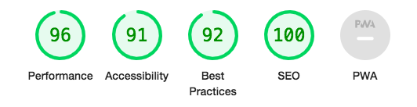
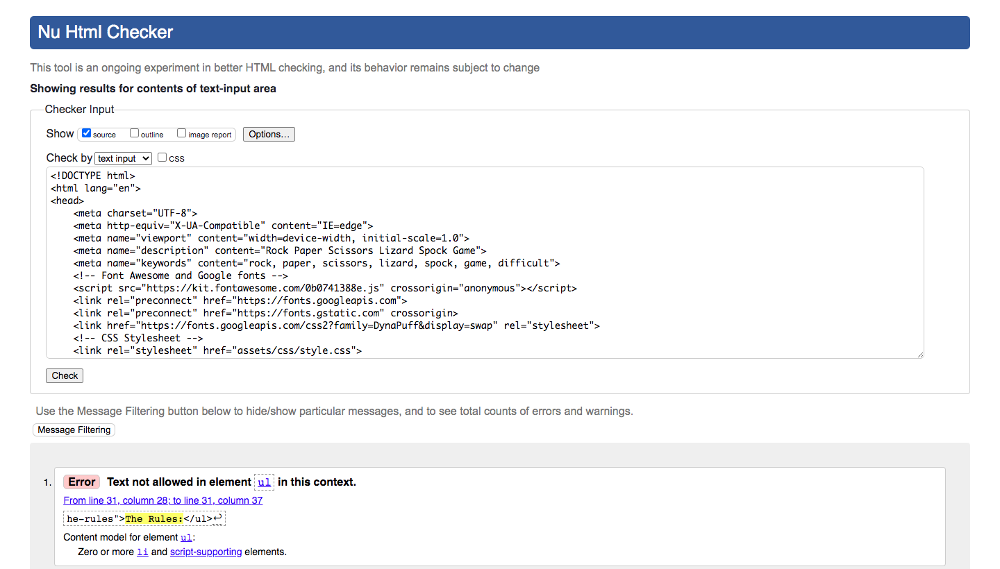
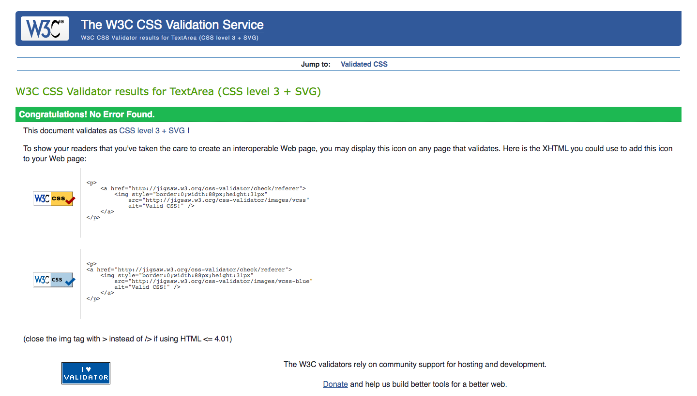

# Rock, Paper, Scissors, Lizard, Spock
Welcome! My name is Gavin O'Connor and this is my Rock, Paper, Scissors, Lizard, Spock game. The purpose of this site is to allow users to play a fun game of Rock, Paper, Scissors, Lizard, Spock, which is a variation on the classic Rock, Paper, Scissors game. The new variation adds two more options for the player to choose from, therefore adding more variety and complexity to a game most people have played their whole lives. The new variation was popularized by the television sitcom "Big Bang Theory".

The game is based on chance by it's very nature and is played against the computer. However, despite this, I have managed to add different difficulty levels to the game which can be chosen by the player. The player loses the game once they have run out of lives, and they lose a life everytime the computer beats them. The difficulty variation comes into play when the player is allowed to choose their starting number of lives before they begin playing. The more lives you start with the easier it is to beat the game, which is done by reaching a score of 10.

The game is intended to be fun to play with a visual flair and clarity to ensure the player knows the rules and can navigate the site without further instruction.

You can access the live site here [here](https://gcgavinoc.github.io/project-2/).

# Table of Contents
[Project Screenshots](#project-screenshots)

[User Experience (UX) Design](#user-experience-ux-design)
 - [User Goals](#user-goals)
 - [User Expectations](#user-expectations)
 - [Color Scheme](#color-scheme)
 - [Images/Videos](#imagesvideos)
 - [Site Skeleton](#site-skeleton)

[Features](#features)
 - [Rules](#rules)
 - [The Game](#the-game)
 - [Win Screen](#win-screen-1)
 - [Lose Screen](#lose-screen-1)

[Technologies used](#technologies-used)

[Testing](#testing)
 - [Google Chrome Developer tools](#google-chrome-developer-tools)
 - [Am I Responsive](#am-i-responsive)
 - [W3C Validator tools](#w3c-validator-tools)

[Manual Testing](#manual-testing)

[Bugs](#bugs)

[Deployment](#deployment)

[Acknowledgements](#acknowledgements)

# Project Screenshots
[Go to top](#table-of-contents)

### **Rules Window**

### **Game**

### **Win Screen**

### **Lose Screen**

# User Experience (UX) Design
[Go to top](#table-of-contents)

This websites primary goal is to allow users to play a fun and engaging game of Rock, Paper, Scissors, with a variation on the rules to allow for more complexity. Adding the two extra options of Lizard and Spock gives the player more to think about when making their choice and therefore makes the game more engaging. Rock, Paper, Scissors is a simple game and so adding these extra choices will help to entertain players as they experience a more complex version of the simple game they likely already know.

As well as this, the difficulty selector adds a level of pressure to the game and the player, as the harder the difficulty you select, the less lives you have and therefore the tighter the margin for error is. If the player wants a challenge they can select hard, or they can enjoy the game and it's mechanics by selecting easy without the added level of pressure. However, this added level of pressure is intended to make the game exciting, as often games on hard difficulty will be very close between the player and computer score.
# User Goals
[Go to top](#table-of-contents)

The goal of this website is to provide users with a fun and engaging game of chance they can play with the option to add an extra level of pressure using the difficulty options. The site puts a twist on a tried and true classic game that most people already know, so this twist will be of interest to most users.
# User Expectations
[Go to top](#table-of-contents)

- This site is designed using a minimalist design philosophy. The intention is to avoid clutter and to present the rules, game buttons, and important game information (difficulty level, score) as clear and concise as possible.
- The site has a video background that makes the site more dynamic but is not too overt, so as to not distract from the content.
- The site is easy to navigate and it is clear what buttons the user can click on through various elements of their design such as hover effects. Buttons turn a certain color on mouse hover and then change to that color once clicked to convey to the player that the selection has been made correctly. Game selection buttons also have a zoom effect on mouse hover to make them more dynamic. 
- The site is designed to be responsive for desktop, laptop, tablet and mobile screen sizes.
- Once the site loads, the user will be greeted with the rules window that clearly and concisely explains the rules of the game, as well as how to re-open the rules window once it is closed. Then after the user chooses their difficulty and clicks play game, the rules window is hidden and they can play the game freely. They can re-open the rules window by clicking the help button. Once the game is won or lost a gif saying win or lose will appear accompanied by a "Play Again" button that resets the game to the beginning again.
## Color Scheme
[Go to top](#table-of-contents)

The color scheme I chose for this game is set to have a 70's theme to it design wise. The background video animation consists of yellow, green, and purple. The buttons and text are all black and white so as to not clash with the background video and it's changing colors, making the game clearly readable. The difficulty tracker turns green, orange or red based on the difficulty chosen and none of these colors clash with the background colors. Also, certain buttons will turn yellow on mouse hover or when clicked. The yellow is different to the 'medium' difficulty option and gives more of a highlighted feeling to the buttons to make it clear to the player that they are clickable and once clicked, that the selection has been made correctly.
## Image/Videos
[Go to top](#table-of-contents)

The background of the site consists of a looping video, which adds a certain dynamism to the site while not being to overt of distracting from the game. The styles and colors of the video also match well with the 70's theme of the site and the font type used for the text elements. The video background helps to draw the users eye to the site as it is constantly moving, to aid in keeping them engaged on the game. The site also uses two gifs, one for when the player wins and one for when the player loses. The gifs state using text whether the player won or lost, to avoid the need to include a seperate text box above or below the gif.

## Site Skeleton
[Go to top](#table-of-contents)

### **Desktop**

### **Mobile**

# Features
[Go to top](#table-of-contents)

## Rules
[Go to top](#table-of-contents)

Upon loading the site, the rules window will appear over the top of the game. The rules window has a welcome message as well as a clear and concise explanation of the rules. This includes explaining the win condition for the game, the lose condition, and what game selections beat what other game selections. The game selections are shown using a Font Awesome icon as opposed to text, as the buttons themselves are symbolised using the icons. Then the player is given three options of how many lives they want to start the game with and each option is labeled based on difficulty; Easy, Medium, and Hard. Then the play buttons will close the rules window and play the game, as long as the player has chosen a difficulty first. If the player clicks the play button before they have chosen a difficulty, an alert message will appear, reminding the player to choose a difficulty. Below the play button is a small hint as to how to re-open the play button if the player want to review the rules again. They are told to click the help button, with the help button symbolised by it's Font Awesome icon, as it appear on the game screen. If the player opens the rules window by clicking the help button, they will not be able to change their difficulty. They will only be able to click play to close the window again. The player can only choose their difficulty either upon first loading the game, or after reseting the game by clicking play again on the win or lose windows.

## The Game
[Go to top](#table-of-contents)

The game screen has the title of the game appear at the top, the number of lives left on the left and the chosen difficulty on the right. The the very center of the screen are the player and computer selection areas with a label for each. Between them is a button labeled shoot and surrounding them are the game selection buttons of Rock, Paper, Scissors, Lizard and Spock. The Player and Computer Score trackers are just below the Shoot button and the help button is located in the top right corner of the screen, out of the way of the rest of the game but still eye catching due to the fact it is near the top of the page and next to the title. If the player hovers their mouse over a game selection button it will have a zoom effect for a more dynamic feel, and a tooltip will appear to let the player know what other two game selection that selection beats. This is handy to quickly inform the player on the rules without them needing to re-open the rules window every time. 

Then the player clicks the selection button and it turns yellow indicating it has been selected correctly while the icon of the button appears in the player selection area. Then the player clicks the 'Shoot!' button and the game is played. The computer selection fills the computer area and the winners selection area turns green while the losers turns red, but if it's a tie then both turn yellow. The scores are incremented appropriately and the number of lives goes down if the computer won. The Shoot button turns to say 'Reset!' instead. Clicking this will reset the selections and the player can make their next selection and play again. If the player clicks 'Shoot!' before making a selection an alert will appear reminding them to do so. If the player clicks another selection button before clicking 'Reset!' an alert will appear reminding them to do so.

The design decision behind having the player make a selection and then click 'Shoot!' to play the game, as opposed to the game simply playing as soon as they click a selection, was to do two things. The first was to emulate the actions players often take when playing the classic Rock, Paper, Scissors game in person. That is to say, when playing in person, both players will say "Rock, Paper, Scissors, Shoot!" out loud, with the intention that both players will reveal their choice on saying the word 'Shoot!'. The second reason for this design decision was to avoid misclicks. If the player were hovering their mouse over a game selection button in order to read the tooltip and accidentally clicked, causing the game to play on that one click would be a bad user experience. Instead, requiring two clicks avoids this while also making the action of clicking the 'Shoot!' have more weight to it, as the player is committing to their decision.

## Win Screen
[Go to top](#table-of-contents)

When the player score reaches 10, the win screen will appear. This consists of a gif that says 'You Win!' and a 'Play Again' button that, once clicked, will reset the game back to the beginning. The reason for the gif as opposed to text is to add more dynamism to the game as well as catching the eye of the player. The gif uses an old school video game style font which is appropriate considering this is a classic game with a retro 70's design style.

## Lose Screen
[Go to top](#table-of-contents)

When the players lives reach 0, the lose screen will appear. This consists of a gif that says 'Game Over, You lose' as well as a play again button that will reset the game to the beginning once clicked. The gif uses an old school video game style font which is appropriate considering this is a classic game with a retro 70's design style.

# Technologies used
[Go to top](#table-of-contents)

[HTML5](https://en.wikipedia.org/wiki/HTML) was used for structuring and presenting content of the website.

[CSS3](https://en.wikipedia.org/wiki/CSS) was used to provide the style to the content written in HTML.

[Balsamiq](https://balsamiq.com/) was used to create wireframes of the websites initial design.

[Google Fonts](https://fonts.google.com/) was used to import the font-family "DynaPuff" into the css file.

[Font Awesome](https://fontawesome.com/) was used to import icons to the site.

[Pexels](https://www.pexels.com/) was used to download the video background.

[Giphy](https://giphy.com/) was used to download the gifs used for the win and lose screens.

[Chrome's developer tools](https://developer.chrome.com/docs/devtools/) were used to debug and to test sites responsiveness. Their lighthouse feature as also used to generate a report on various aspects of the sites performance and functionality.

[Github](https://github.com/) was used to create the repository that hosts the site and to store the project's code after it was pushed from Git.

[Gitpod](https://gitpod.io/workspaces) was used as the Code Editor used for the site.

[Am I Responsive](https://ui.dev/amiresponsive) was used to test the sites responsiveness on various screen sizes.

[W3C Markup](https://validator.w3.org/) and [Jigsaw](https://jigsaw.w3.org/css-validator/) validation tools were used to validate the HTML code and CSS style used in the project.

[JS Hint](https://jshint.com/) was used to validate the Javascript code used in the project.

# Testing
[Go to top](#table-of-contents)

## Google Chrome Developer tools
[Go to top](#table-of-contents)

This tool can be accessed by right clicking on a website and clicking on inspect in the menu that appears. I used this tool to check the responsiveness of the site by changing the size of the window that the site appears in. I checked all screen sizes by reducing the width of the screen and adding media queries to the CSS file for every element that appeared incorrectly on the different sizes. I also utilized the dev tools 'lighthouse' feature in order to generate a report that provides a score on the sites Performance, Accessibility, Best practices, and SEO. This report is displayed below.

## Am I Responsive
[Go to top](#table-of-contents)

This tool was used to check if the site was responsive for desktop, laptop, tablet, and mobile screen sizes. The site generates an image showing what the site will look like on each device type.

## W3C Validator tools
[Go to top](#table-of-contents)

This tool was used to validate the HTML and CSS code used across the site. The code was entered into the tool using the direct input option. If there are any issues with the code, this tool will indicate as such by briefly describing the issue and then pointing to where the issue appears in the code along with a display of a snippet of the code in question and the problem highlighted.

### **HTML Code**
Upon entering my HTML code into the W3C validator, I was presented with a few errors. The first was related to the rules screen, whereby I had the list of rules in an unordered list. However, the error was that the ul element contained text which I was using as the heading for the list of rules. The second error was related to some properties belonging to the gifs I had imported to from Giphy. They stated that using 100% for the height and width properties was not valid. The last error was that I had an id on used on two different elements.

In order to fix these errors, I removed the text in the ul element and instead created a p element above it to include the text for the rules heading. Then I moved the style properties from the HTML file to the CSS file for the gifs. Lastly I changed the ID that was used twice into a class.

### **CSS Code**
Upon entering my CSS code into the W3C CSS validator, no errors were found.

### **Javascript Code**

## Manual Testing

[Go to top](#table-of-contents)

The site was tested on the following screen sizes:
1600px wide
1400px wide
1000px wide
980px wide
910px wide
840px wide
780px wide
650px wide
500px wide
350 px wide

Please find below the results of manually testing each feature across the above mentioned screen sizes.

### **Rules**

TEST            | OUTCOME                          | PASS / FAIL  
--------------- | -------------------------------- | ---------------
Text and Icons | All rules text and Font Awesome Icons loaded fully and correctly. | PASS
Difficulty selection buttons | On mouse hover, the easy difficulty button turned green, the medium button turned orange and the hard button turned red. Each difficulty button changed from white to it's corresponding color on click, and the lives area on the game screen changed to the number of lives associated with the button clicked. The difficulty tracker on the right side also changed the background color of the selected difficulty to it's corresponding color. If a different difficulty was selected, the color of the difficulty button that was previously clicked turned back to white. If the rules window was opened using the help button, the difficulty selection buttons became unclickable. | PASS
Play button | The play button turned from white to yellow on mouse hover, and hid the rules window on click. If the play button was clicked before a difficulty was selected, an alert message appeared reminding the player to select a difficulty | PASS
|||

### **The Game**

TEST            | OUTCOME                          | PASS / FAIL  
--------------- | -------------------------------- | ---------------
Game selection buttons | The game selection buttons, Rock, Paper, Scissors, Lizard, Spock, all had a zoom effect on mouse hover, as well as a tooltip that appeared stating the rules for which other selection that selection beat. On click, they turned yellow. If a different selection button was clicked, the previous selection button that was clicked turned back to white. The icon of the button that was clicked appeared in the player choice area. | PASS
Shoot button | When the shoot button was clicked, if there was no player selection made, an alert appeared reminding the player to do so. If a selection was made, then the computer choice area was filled with the icon of a random selection. The winners selectin area turned green while the losers turned red. Both areas turned yellow if the result was a tie. The Player score and Computer score tracker incremented appropriately and the lives tracker decremented if the computer won. The text on the shoot button turned from 'Shoot!' to 'Reset!'. If a selection button was clicked while the shoot button said 'Reset!' then an alert appeared reminding the player to click the reset button. Once the reset button was clicked it's text changed back to 'Shoot!', the two selection areas were cleared of their icons and turned back to white and the selected button turned back from yellow to white. | PASS
Help button | Upon clicking the help button, the rules screen appeared. The initially selected difficulty was still selected and none of the difficulty selection buttons were clickable. The Play button closed the rules window again on click. | PASS
|||

### **Win and Lose**

TEST            | OUTCOME                          | PASS / FAIL  
--------------- | -------------------------------- | ---------------
Gifs | The gifs loaded correctly and played correctly once the player score reached 10, or the lives counter reached 0. | PASS
Play Again button | The play again button appeared correctly under the gifs. It turned from white to yellow on mouse hover. On click, it reset the score tracker and lives tracker by replacing the lives with an X symbol. All selected buttons and areas turned back to white. The selected difficulty in the difficulty tracker turned back to white. The rules screen appeared again, and the difficulty buttons were not selected and had turned back to white. They were clickable again, regained their on hover functionality and changed to the appropriate color on click, changing the lives tracker and difficulty tracker correctly as well. The play button closed the rules window correctly. All functions and mechanics worked correctly as stated above even after the play again button was clicked and everything was reset. | PASS
|||

### **Video Background**

TEST            | OUTCOME                          | PASS / FAIL  
--------------- | -------------------------------- | ---------------
Video Background load | The video background loads and autoplays correctly and instantly on page load across all three pages and all screen sizes| PASS
Video loop | The video background loops correcly and smoothly across all three pages and all screen sizes with no interruption between loop cycles| PASS
Video screen size fit | The video background fits correctly on all screen sizes for all three pages. The video background covers the whole page with no gaps or margins and does not appear stretched or compacted on different screen sizes| PASS
|||

# Bugs

[Go to top](#table-of-contents)

## Solved Bugs
 - The main bugs I encountered while creating this game were to do with clicking buttons that the player should not be allowed to click at certain times. The first bug occured after the player had selected their difficulty and clicked the play button, closing the rules window, if they clicked the help button to re-open the rules window they were able to click a difficulty selection button again and give themselves more lives, thereby ensuring they would never lose the game. I fixed this bug by making the difficulty selection buttons unclickable if the rules window was opened using the help button. This was done via Javascript.

 - The second bug occurred when the player clicked the shoot button before making a selection. This caused the computer selection area to fill. This had no negative repercussions on the game, but was a bad user experience. Therefore I added an alert message if the shoot button was clicked while no player selection was made.

 - The third bug occurred after the shoot button had been clicked. The player was able to click other selections and fill their selection area with those other selections. Again this had no negative repercussions on the game itself but was a bad user experience. Users could say the game was broken by clicking shoot, seeing the winner and then changing their selection to make it look as though they lost when they should have won or vice versa. I fixed this bug by adding an alert message if a selection was clicked before the reset button was clicked.

# Deployment

[Go to top](#table-of-contents)

The site was deployed to GitHub pages using the following steps:

1. Navigate to Github - (https://github.com/)

2. Sign up to GitHub.

3. Create a new repository on GitHub called project-2.

4. Click on settings on the navigation bar under the repository title.

5. Select the pages tab on the left side menu bar.

6. Under source, click on the branch drop down menu, select main and click save.

7. The site will then deploy, which may take a few moments.

8. Once it has deployed the page will refresh with the message "Your site is published at" accompanied by a live page link.

The live link can be found here - (https://gcgavinoc.github.io/project-2/)

# Acknowledgements

[Go to top](#table-of-contents)

- The initial structure of the Score tracker, and Style of the selection buttons was borrowed from the Love Maths project
- How to add two functions to an event listener was learned from https://stackoverflow.com/questions/25028853/addeventlistener-two-functions
- How to decide a winner in a game of Rock, Paper, Scissors was learned from https://www.geeksforgeeks.org/rock-paper-and-scissor-game-using-javascript/
- How to have the computer select a random choice was learned from https://www.youtube.com/watch?v=n1_vHArDBRA&list=WL&index=26&t=333s&ab_channel=BroCode
- How to create a tooltip was learned from https://www.w3schools.com/css/css_tooltip.asp
- Inspiration for the README.md file structure was taken from https://github.com/dhakal79/Portfolio-project-MS1
- The font used for the site was taken from [Google Fonts](https://fonts.google.com/).
- The various icons used for the site were taken from [Font Awesome](https://fontawesome.com/).
- The Video Background was downloaded from [Pexels](https://www.pexels.com/).
- The Gifs were sourced from [Giphy](https://giphy.com/)
- The initial CSS code for the video background was borrowed from [Stack Overflow](https://stackoverflow.com/questions/49963974/how-to-add-background-video-to-html-page).
- Thanks to my mentor Marcel Mulders for his constructive feedback and guidance during the development of this project.